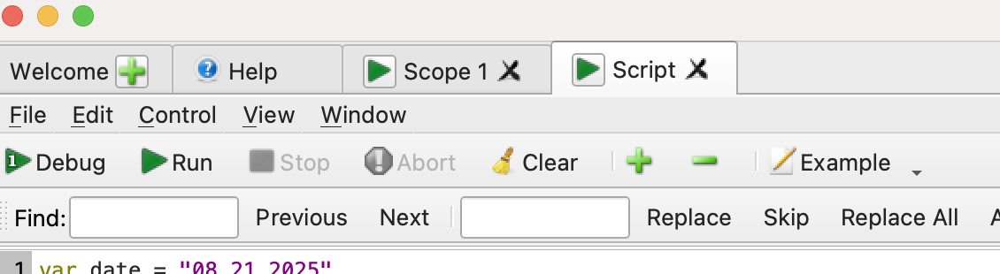

# Mini Runbook

1. Open up Scope and Script in Waveform SDK.

2. Copy __DAQ_script.js__ into Script and hit the green run button. The recording will start promptly after.

Note that you can customize recording duration for each triggered sample, sample rate, file name, and destination path of the file in the recording script.

3. Refer to the terminal output as the recording goes on, hit the stop button on Waveform SDK or use the terminal command Ctrl + C to terminate the recording. The recordings will be stored in .csv within a folder named after the variable "date". Each recording contains a 3 ms frame of data.

## Note

- A peculiarity of the automated recording program is that although the position is set to zero, the triggered recording will start from a negative time value. For instance, if one sets a recording duration of 3 ms, the recorded output will contain data from -1.5 ms to 1.5 ms, with the data between -1.5 ms and 0 s being undesired junk data and 0s being when the trigger is received. As a result, in the best interest of optimizing storage space, one should consider doing some pre-processing work on the csv files where the data recorded before 0 s is removed. An example of this processing involving a simple plotting feature is documented in __data_processing.py__.

- You can change the channel you are measuring from by selecting/de-selecting the channels in the "Scope" interface on Waveform SDK

